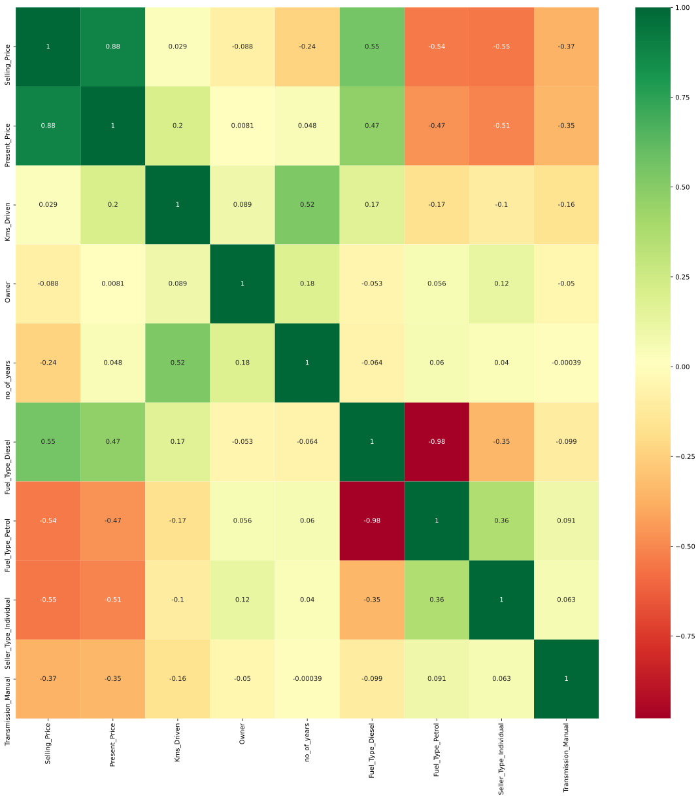

# Car Price Predictor
> Made by Parth Mistry
* Created a tool which helps people to check the resale value of the car when they want to sell them.
* Engineered features from the data like the fuel of the vehicle to obtain the exact selling value.
* Optimized Random Forest Regressors using GridsearchCV to reach the best model.
* Built a client facing web-application using Flask.

---
## Code and Resources used
**Python Version:** 3.7  
**Packages:** pandas, numpy, sklearn, matplotlib, seaborn, selenium, flask, json, pickle  
**For Web Framework Requirements:** ```pip install -r requirements.txt```  
**Dataset:** [Download from here](https://www.kaggle.com/nehalbirla/vehicle-dataset-from-cardekho)  

---
## Data Cleaning
* The dataset required cleaning before we can provide it to the model for training.
* There were some categorical features which needed encoding. Those features are fuel type, seller type, transmission and owner.
* ```pd.getdummies()``` was the choice of function for encoding the data.
* Added another column of ```no_of_years``` from ```years``` feature.

---
## EDA
* Here are the highlights from the Exploratory data analysis on the data.
* Created a correlation matrix to find the relation between various features.  

* Used an algorithm called ```ExtraTreesRegressor``` to get the important features of the dataset.  


---
## Model Building
* The dataset after transforming the categorical variables was split into train set and test set where test set had 20% of data.  
* Used ```Random Forest Regressor``` because of the sparsity in the data and the rate of overfitting will also decrease.  
* Also used ```RandomizedSearchCV``` as a part of hyperparameter tuning which gained the best parameters to train the model.  


---
## Productionization
* Used pickle to save the model which was placed in a smaill Flask application.
* The web-application was deployed to Heroku which is a Platform as a Service to run the application.
* Link to the application: https://mycarpricepredic.herokuapp.com/
